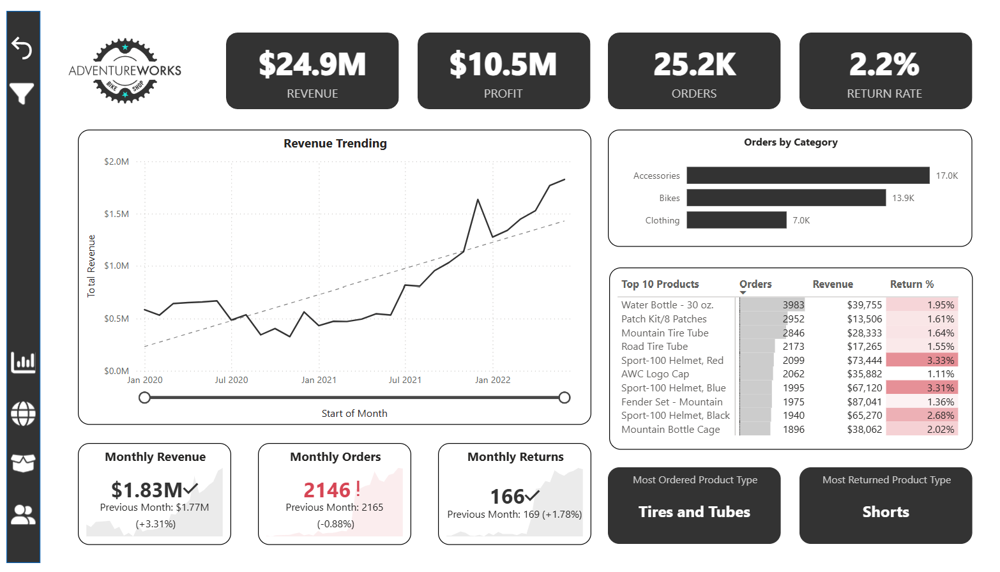
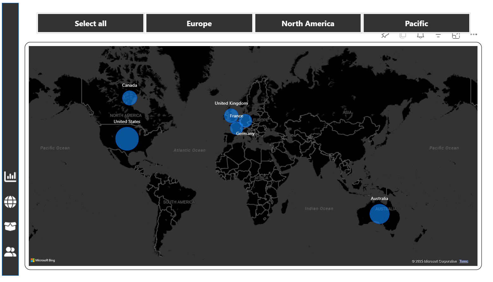
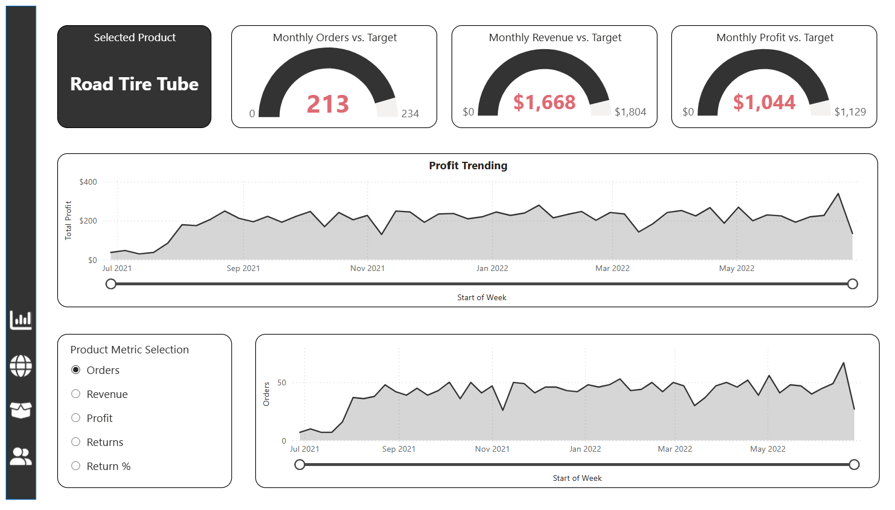
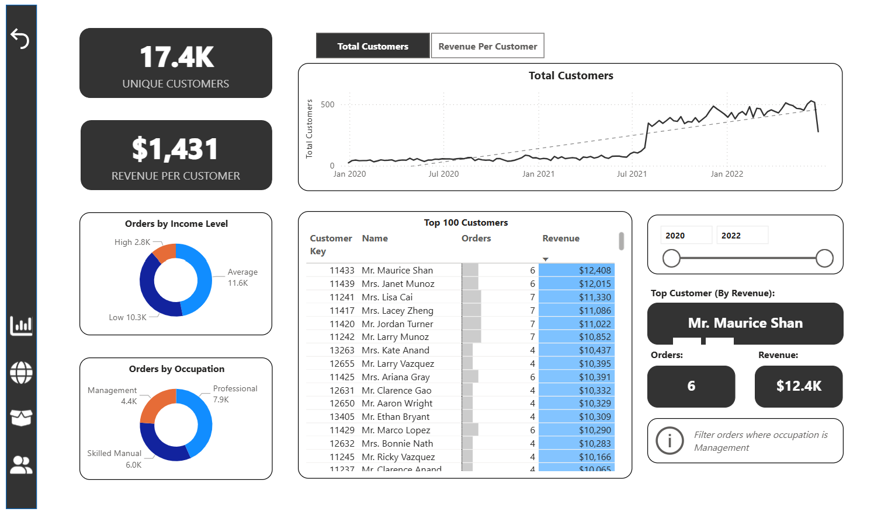

# End-to-End Power BI Dashboard – Adventure Works

**Project Duration:** June 2025  
**Tools Used:** Power BI, Power Query (UI and M Language), DAX

## Overview

This project presents a fully interactive Power BI dashboard built for an imaginary business using unstructured sample data from the Adventure Works dataset. It simulates a real-world analytics workflow—from raw data ingestion to the delivery of business-ready insights.

## Key Highlights

- **ETL with Power Query**  
  Cleaned and standardized raw data using both Power BI’s UI-based tools and custom M language scripting. Addressed null values, formatting issues, and structured unorganized tables into usable formats.

- **Data Modeling**  
  Designed a star schema model with clearly defined fact and dimension tables, ensuring efficient data relationships and enabling smooth reporting.

- **DAX Measures**  
  Created several analytical DAX measures to provide meaningful insights, including:
  - Total Sales
  - Average Discount
  - Customer Segmentation
  - Order Status Breakdown

- **Interactive Reporting**  
  Built user-friendly dashboards with slicers, drill-downs, filters, and dynamic visuals, enabling end users to explore data by category, region, and time period.

- **Data Storytelling**  
  Prioritized readability and visual clarity, ensuring the dashboard is accessible to both technical and non-technical stakeholders.

## Skills Demonstrated

- Full Power BI development lifecycle from raw data to final dashboard
- ETL using Power Query (UI and M scripting)
- Data modeling using star schema
- Analytical calculations with DAX
- Report design and user experience considerations

## Screenshots

### Executive Dashboard Page

### Map Page  

### Product Details Page  

### Customer Details Page  

## License

This project was developed for educational and portfolio purposes. The data used is publicly available sample data from the Adventure Works dataset.

## Contact

For any questions or collaborations, feel free to connect with me on [LinkedIn](linkedin.com/in/suyash-ratnaparkhi-a894a8373).

