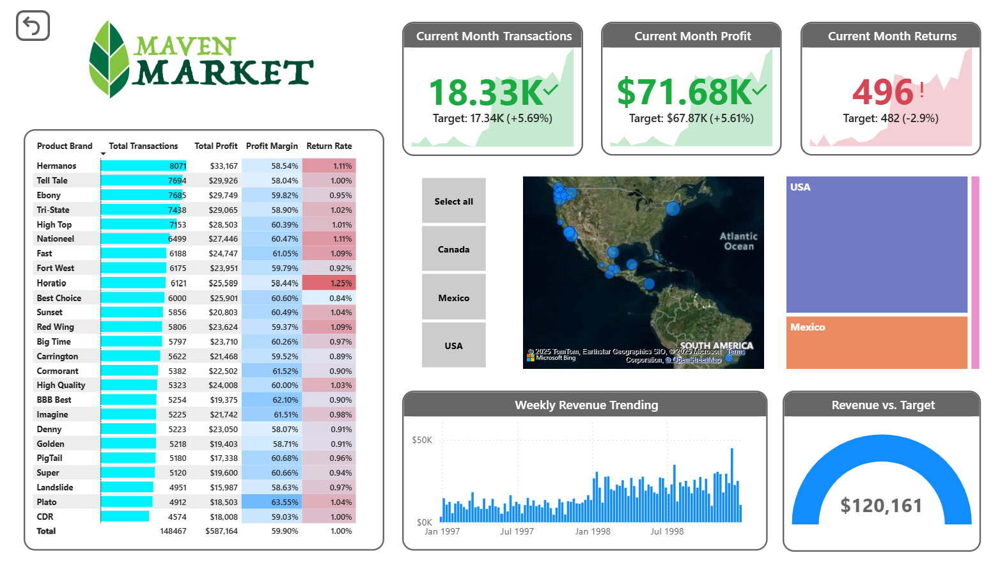

# End-to-End Power BI Dashboard – Maven Market

**Project Duration:** July 2025  
**Tools Used:** Power BI, Power Query (UI and M Language), DAX

## Overview

This project presents a comprehensive Power BI dashboard built for an imaginary business scenario using unstructured sample data from a fictional retail dataset called Maven Market. It replicates the full data analytics workflow—from raw data ingestion to producing actionable, business-ready insights.

## Key Highlights

- **ETL and Data Preparation**  
  Cleaned and transformed raw, unstructured data using Power Query's UI-based tools and M language scripting. Handled missing values, standardized formats, and reshaped inconsistent tables into structured datasets.

- **Data Modeling**  
  Constructed a robust star schema by defining appropriate fact and dimension tables to enable efficient querying and accurate reporting.

- **DAX Measures**  
  Created custom DAX formulas to derive key performance metrics including:
  - Total Sales
  - Average Discount
  - Customer Behavior Trends
  - Order Status Breakdown

- **Report Design**  
  Developed a fully interactive dashboard featuring slicers, drill-down capabilities, and filters. Enabled users to explore data dynamically by category, region, and date.

- **User-Centric Experience**  
  Focused on clear visual design and effective data storytelling to make the report accessible for both technical and non-technical users.

## Skills Demonstrated

- End-to-end Power BI development lifecycle
- ETL using Power Query (UI and M scripting)
- Star schema data modeling
- DAX for advanced business logic
- Interactive reporting with emphasis on usability

## Screenshots

### Dashboard

## License

This project is intended for educational and portfolio demonstration purposes. The dataset used is fictional and publicly available.

## Contact

For any questions or collaborations, feel free to connect with me on [LinkedIn](linkedin.com/in/suyash-ratnaparkhi-a894a8373).
