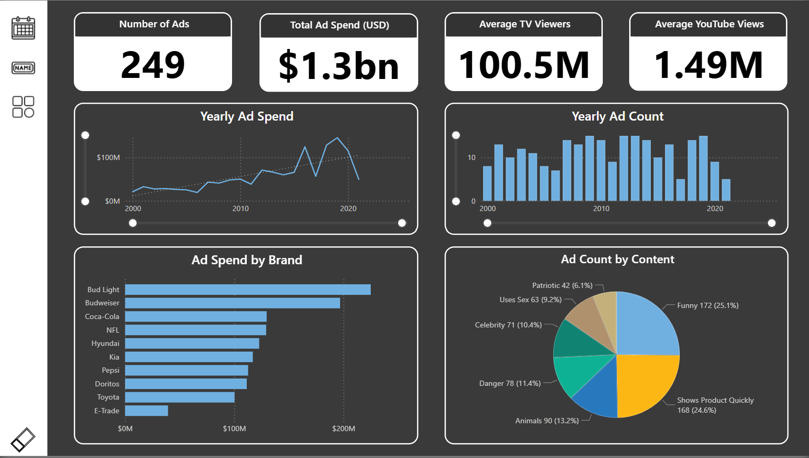
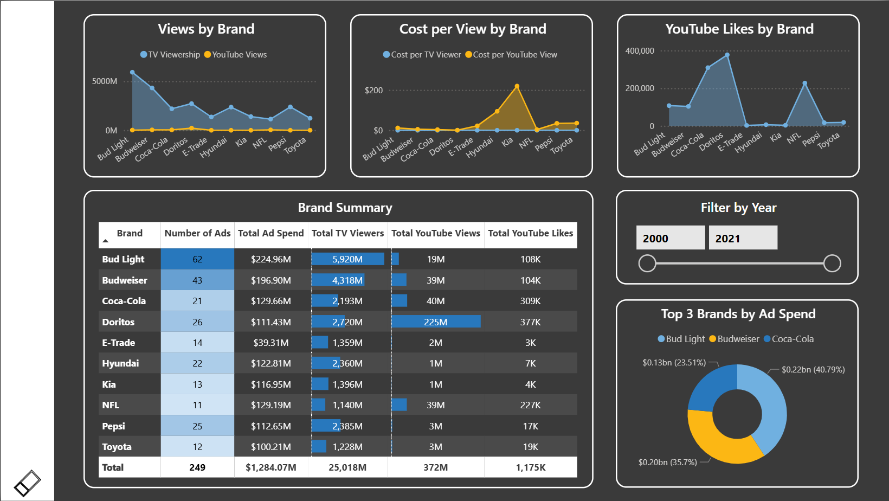
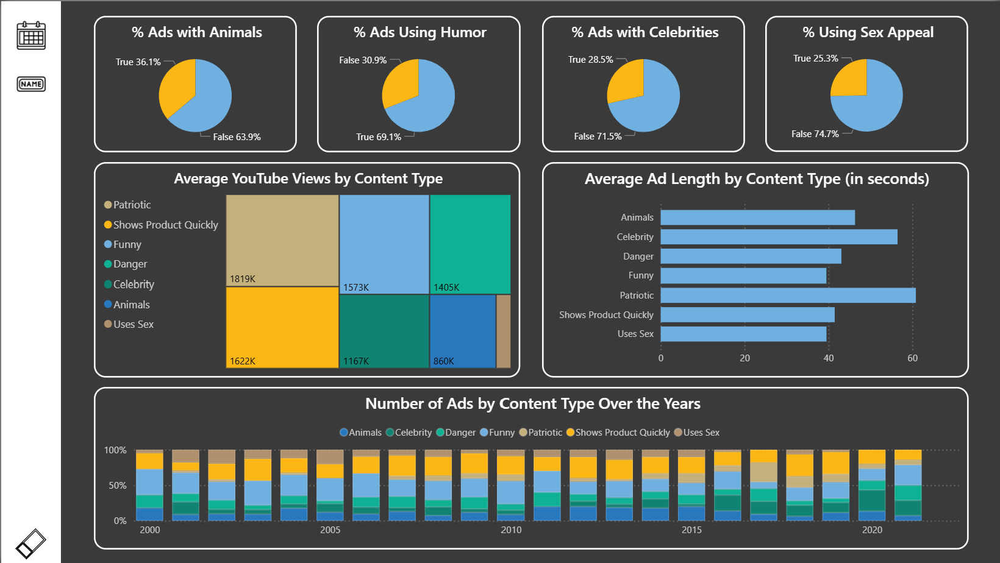

# Super Bowl Commercials Ad Analysis – Power BI Portfolio Project

**Project Duration:** July 2025  
**Tools Used:** Power BI Desktop, Power Query (M Language), DAX, Star Schema Design

## Overview

This project simulates a complete Business Intelligence workflow based on a flat dataset of Super Bowl commercials. Starting with raw CSV data, the project covers all major phases of BI development including data cleaning, data modeling, analytical measure creation, and interactive report building. It mirrors a real-world scenario where unstructured marketing data is turned into strategic business insights.

## Objective

To analyze Super Bowl ad trends over time, evaluate brand performance, and assess the effectiveness of different content strategies (such as humor, celebrities, animals, etc.) in driving viewer engagement and ROI.

## ETL and Data Modeling

- Cleaned and transformed the raw dataset using Power Query (M Language)
- Replaced nulls with placeholder values and logical flags
- Built a star schema data model with:
  - `FactSuperbowlAds`
  - `DimDate`
  - `DimBrand`
  - `DimAdContent`
- Ensured properly defined relationships and an optimized model for DAX calculations

## Key Measures

- Total Ad Spend  
- Number of Ads  
- Average TV Viewers and YouTube Views  
- Percentage of Ads using Humor, Celebrities, Animals, Sex Appeal  
- Cost per View (TV and YouTube)  
- Year-over-Year Ad Spend Change  
- Brand-Level YouTube Likes and Views

## Report Pages and Visual Highlights

1. **Executive Summary**  
   - KPI cards for high-level metrics  
   - Yearly ad spend trend  
   - Ad count by year  
   - Brand-wise ad spend  
   - Content type distribution pie chart  

2. **Brand Performance Analysis**  
   - Brand-level viewership metrics  
   - Cost per view comparison  
   - YouTube likes  
   - Dynamic year filtering  
   - Summary matrix table  

3. **Content Strategy Analysis**  
   - Treemap and bar charts showing average YouTube views and ad lengths by content type  
   - Percentage breakdown of humor, celebrity, and animal-themed ads over the years  

## Outcome

The final report provides strategic insights into advertising decisions surrounding Super Bowl commercials. It reveals how top brands allocate budgets, how content types affect engagement, and which strategies generate the highest ROI. This project demonstrates the complete BI development cycle and is ideal for executive dashboards, marketing teams, and ad performance reviews.

## Screenshots

### Executive Summary  

### Brand Performance Analysis  

### Content Strategy Analysis  

## License

This project is intended for educational and portfolio demonstration purposes. The dataset used is fictional and publicly available.

## Contact

For any questions or collaborations, feel free to connect with me on [LinkedIn](linkedin.com/in/suyash-ratnaparkhi-a894a8373).

